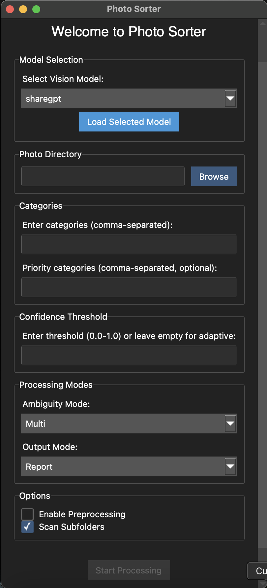

# Photo Sorter

A Python-based GUI application that leverages advanced vision-language models through LM Studio to intelligently organize and categorize photos. This project demonstrates the practical application of agentic AI, where machine learning models act as intelligent agents to understand, analyze, and organize visual content based on natural language descriptions.

[](https://opensource.org/licenses/MIT)

## 🤖 AI Technology

Photo Sorter represents a cutting-edge application of vision-language models (VLMs) in practical automation. These models combine:

- **Visual Understanding**: Advanced neural networks process images at multiple levels, from basic features to complex semantic content
- **Natural Language Processing**: The system interprets user-defined categories and generates human-readable descriptions
- **Agentic Decision Making**: Rather than simple classification, the AI acts as an agent to:
  - Understand category priorities and relationships
  - Make nuanced decisions about image categorization
  - Adapt confidence thresholds based on content distribution
  - Handle ambiguous cases intelligently

This approach enables the system to perform tasks that traditionally required human judgment, such as understanding that a "beach vacation" photo might belong in both "Vacation" and "Nature" categories, with contextually appropriate confidence levels.

## 📸 Interface



*A modern, dark-themed interface that brings AI capabilities to your desktop. The GUI provides intuitive controls for model selection, category management, and processing options, making advanced AI technology accessible to everyone.*

## 🌟 Features

- **Modern GUI Interface**: Built with ttkbootstrap for a clean, modern look
- **Flexible Model Selection**: Choose from available LM Studio vision models
- **Smart Categorization**:
  - Support for multiple categories per photo
  - Priority category system for focused categorization
  - Adaptive confidence thresholding
- **Multiple Output Modes**:
  - Move: Organize photos into category folders
  - Copy: Create category folders while preserving originals
  - Report: Generate detailed analysis without moving files
- **Advanced Processing**:
  - Recursive subfolder scanning
  - Real-time progress tracking
  - Support for JPG, PNG, and WEBP formats
- **Validation & Error Handling**:
  - Input validation for all settings
  - Comprehensive error reporting
  - Safe file operations

## 🚀 Quick Start

### Prerequisites

- Python 3.6 or higher
- LM Studio installed and running locally
- A compatible vision model in LM Studio

### Installation

1. Clone the repository:
```bash
git clone https://github.com/yourusername/photo-sorter.git
cd photo-sorter
```

2. Create and activate a virtual environment:
```bash
python -m venv venv
source venv/bin/activate  # On Windows: venv\Scripts\activate
```

3. Install required packages:
```bash
pip install -r requirements.txt
```

### Usage

1. Start LM Studio and ensure it's running on http://localhost:1234

2. Launch the application:
```bash
python gui.py
```

3. In the GUI:
   - Select a vision model from the dropdown
   - Click "Load Selected Model"
   - Choose your photo directory using "Browse"
   - Enter categories (comma-separated)
   - Optionally specify priority categories
   - Set confidence threshold or use adaptive
   - Choose output mode (Move/Copy/Report)
   - Click "Test with First Image" to verify setup
   - Click "Start Processing" to begin

## 📋 Configuration Options

### Categories
- Main categories: Required, comma-separated (e.g., "Family, Vacation, Pets")
- Priority categories: Optional, must be subset of main categories
- Will be used for model prompting and classification

### Processing Modes
- **Ambiguity Mode**:
  - Single: Use highest confidence category only
  - Multi: Allow multiple categories per image
- **Output Mode**:
  - Move: Relocate images to category folders
  - Copy: Create copies in category folders
  - Report: Generate analysis report only

### Advanced Settings
- Confidence Threshold: 0.0-1.0 or adaptive
- Subfolder Scanning: Include nested directories
- Preprocessing: Enable image optimization

## 📊 Output Format

### Report Mode
Generates a detailed report file containing:
- Processing timestamp
- Applied settings
- Per-image results with confidence scores
- Priority category matches
- Processing statistics

### File Organization
When using Move/Copy modes:
- Creates category folders
- Handles naming conflicts
- Preserves original paths in Copy mode
- Maintains image metadata

## 🤝 Contributing

Contributions are welcome! Please feel free to submit a Pull Request. For major changes, please open an issue first to discuss what you would like to change.

## 📝 License

This project is licensed under the MIT License - see the [LICENSE](LICENSE) file for details. 